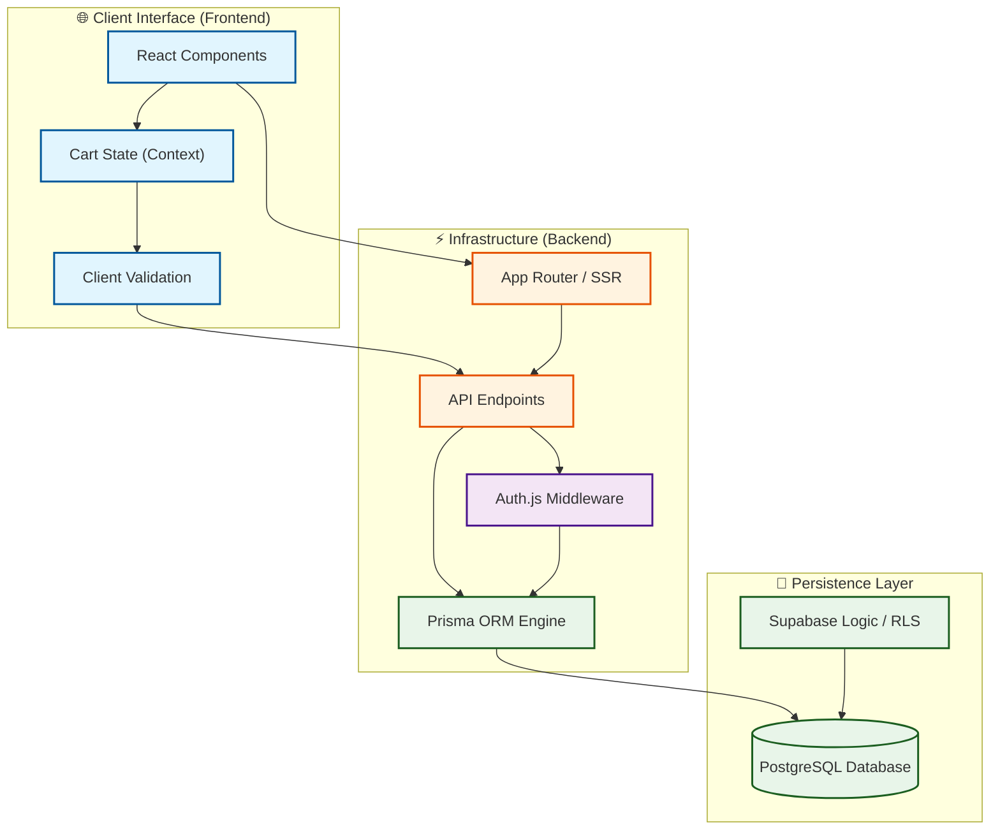

# 👒 MODERN_ESTHETE - Professional Backend Systems

  

---

## 🎯 Technical Objective & Professional Approach

Modern Esthete is a production-grade Web Application and Backend API ecosystem. This project is engineered with a strict **DevSecOps mindset**, emphasizing a clear separation between a fully featured private laboratory (GitLab) and a sanitized public portfolio presentation (GitHub). This ensures ethical distribution of code, protection of intellectual property, and safe demonstration of architectural capabilities.

## 🗂️ DevSecOps Architecture Flow

We use a dual-repository architecture enforced by automation:

- **GitLab (Private Lab):** The absolute Source of Truth. Contains CI/CD pipelines (`.gitlab-ci.yml`), raw testing infrastructure (`tests/`), backend configuration specifics (`configs/`), and advanced automation scripts.
- **GitHub (Public Portfolio):** A sanitized showcase of the code. All sensitive infrastructure and test data are stripped automatically to maintain security while still presenting a clean, readable frontend and core architecture.

### Repository Structure
- `src/`: Core Next.js Application and API logic.
- `docs/`: Contribution guidelines and general documentation.
- `diagrams/`: Architectural schemas and models.
- `configs/database/`: Database policies and configurations.
- `scripts/`: DevSecOps automation, including the sanitization logic.
- `tests/`: Automated unit and end-to-end tests (GitLab only).

---

## 🛠️ Tech Stack

- **Framework**: `Next.js 16` (App Router, Server Actions, Middleware).
- **Styling**: `Tailwind CSS 4.x` with modern design patterns.
- **ORM & DB**: `Prisma v6` + `Supabase` (PostgreSQL) with RLS security.
- **Auth**: `Auth.js v5` (NextAuth Beta) for secure session handling.
- **Validation**: `Zod` for schema-based data integrity.

---

## 🏗️ Backend System Architecture

The infrastructure uses serverless functions natively via Next.js coupled with robust Edge database routing.

```mermaid
graph TD
    %% Global Styles
    classDef client fill:#e1f5fe,stroke:#01579b,stroke-width:2px;
    classDef server fill:#fff3e0,stroke:#e65100,stroke-width:2px;
    classDef security fill:#f3e5f5,stroke:#4a148c,stroke-width:2px;
    classDef database fill:#e8f5e9,stroke:#1b5e20,stroke-width:2px;

    subgraph Client ["🌐 Client Interface (Frontend)"]
        UI["React Components"]
        State["Cart State (Context)"]
        Logic["Client Validation"]
    end

    subgraph Server ["⚡ Infrastructure (Backend)"]
        Routes["App Router / SSR"]
        API["API Endpoints"]
        Auth["Auth.js Middleware"]
        Prisma["Prisma ORM Engine"]
    end

    subgraph Data ["💾 Persistence Layer"]
        Postgres[(PostgreSQL Database)]
        Supabase["Supabase Logic / RLS"]
    end

    %% Connections
    UI --> State
    State --> Logic
    Logic --> API
    UI --> Routes
    Routes --> API
    API --> Auth
    API --> Prisma
    Auth --> Prisma
    Prisma --> Postgres
    Supabase --> Postgres

    %% Assign Classes
    class UI,State,Logic client;
    class Routes,API server;
    class Auth security;
    class Prisma,Postgres,Supabase database;
```

---

## 🛡️ Security Model & CI/CD Pipeline

- **Row Level Security (RLS)**: Core data bounded at the database layer (Supabase).
- **Zod Validation**: Strict validation for all incoming RPCs requests.
- **GitLab CI/CD**: Enforces Linting, Unit testing, and Semgrep SAST scanning on all internal pull requests.

## 🚀 The `publish_public.ps1` Pipeline

Located in `scripts/publish_public.ps1`, this PowerShell automation is the backbone of our dual-repo strategy.

**How it works:**
1. Validates a clean local state on the `main` branch.
2. Synchronizes fully with the GitLab private laboratory.
3. Generates a temporary `public` branch in isolation.
4. Purges all tests, CI configurations, infrastructure setup, and sensitive dotfiles using `git rm --cached`.
5. Pushes the sanitized snapshot forcefully to the GitHub repository as a portfolio representation.
6. Returns developers to their original context without data loss.

> [!WARNING]
> Do NOT execute the publishing script if you are not authorized to deploy to the public origin.

---

## 🤝 Contributing

Developed with ❤️ for the Tech Community. For internal team members, please refer to `/docs/CONTRIBUTING.md`.

---

## 📜 Licencia

Este proyecto está bajo la licencia MIT. Puedes usarlo libremente, siempre citando al autor.